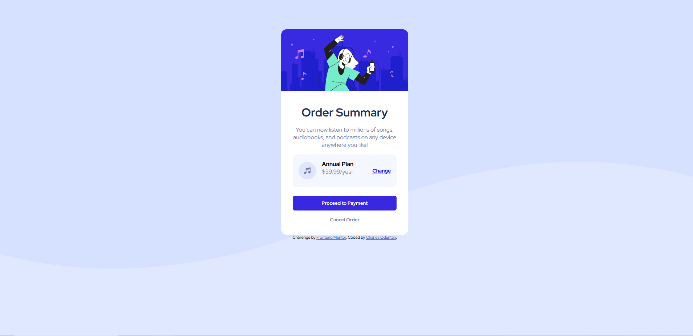

#

## Table of contents
  - [Screenshot](#screenshot)
  - [Built with](#built-with)
  - [What I learned](#what-i-learned)
  - [Useful resources](#useful-resources)

### Screenshot

### Built with

- Semantic HTML5 markup
- CSS custom properties
- Flexbox

### What I learned 

By Completing this project from frontend mentor I learned how to use a Flexbox to center and align elements. I also learnt that the use of Box shadows and border-radiuses give a soft card effect and how Consistent padding/margins maintain clean spacing.

### Useful resources

- [w3schools](https://www.w3schools.com) - This helped me when ever got stuck with code or i just needed a reminder about how to do something i previously learnt. I really like this website and will use it going forward.

